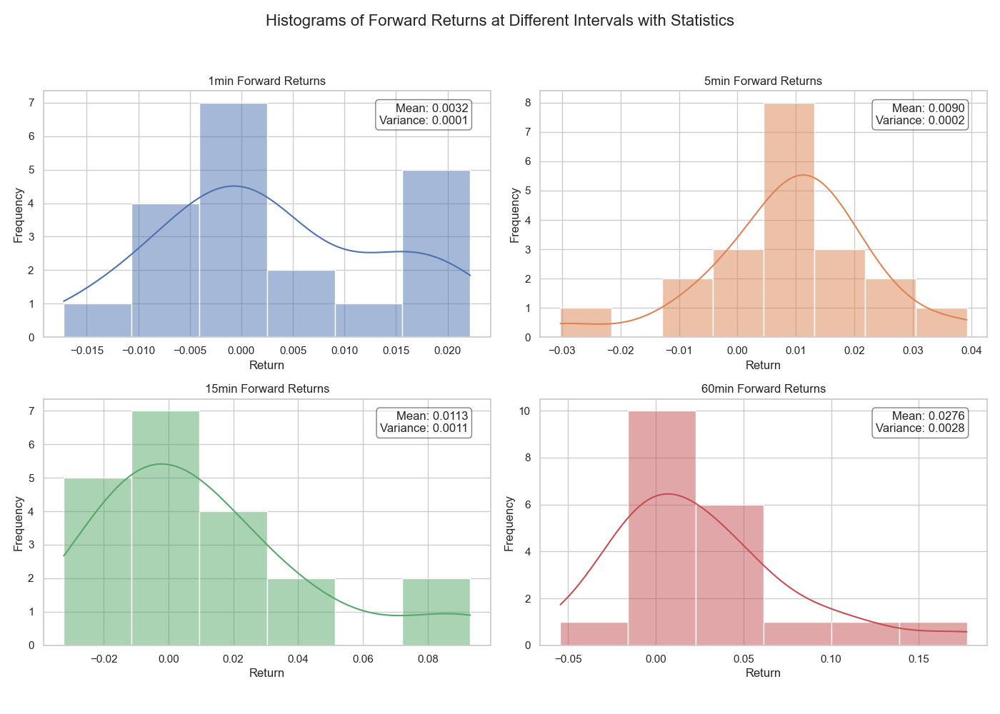

# [How to Trade $GME like a Quant with Python](https://youtu.be/J5KYylYgGQ4?feature=shared)

When RoaringKitty tweets, the market listens. We collect a dataset of RoaringKitty tweets using Selenium to extract their timestamps from the browser, then we collect historical $GME price data to assess the market impact of these tweets. With historical prices, we calculate the forward returns for different time periods and plot a histogram to see how much predictive power a new tweet really has.

See chart below with data up to 5/15/24:

## Usage

* Run `login.py` to launch a browser session and enter X.com credentials. The cookie will be written to a .pkl file locally so it can be used to authenticate into future sessions.
* Run `get_tweets.py` to launch Selenium and collect tweets from @TheRoaringKitty's timeline. These will be written to a CSV.
* Run `get_returns.py` to collect 1 minute historical price data for $GME from the Alpaca Markets API. An API key and secret are required.
* Run `visualize_results.py` to plot a histogram of forward returns at different time intervals when tweets go out.

## Links

* [Full Tutorial (YouTube)](https://youtu.be/J5KYylYgGQ4?feature=shared)
* [**Learn Python for Trading Masterclass**](https://pythonfortraders.io/p/masterclass)
* [Our Homepage](https://pythonfortraders.io)
* [Connect with us on Twitter](https://twitter.com/PythonTraders)
